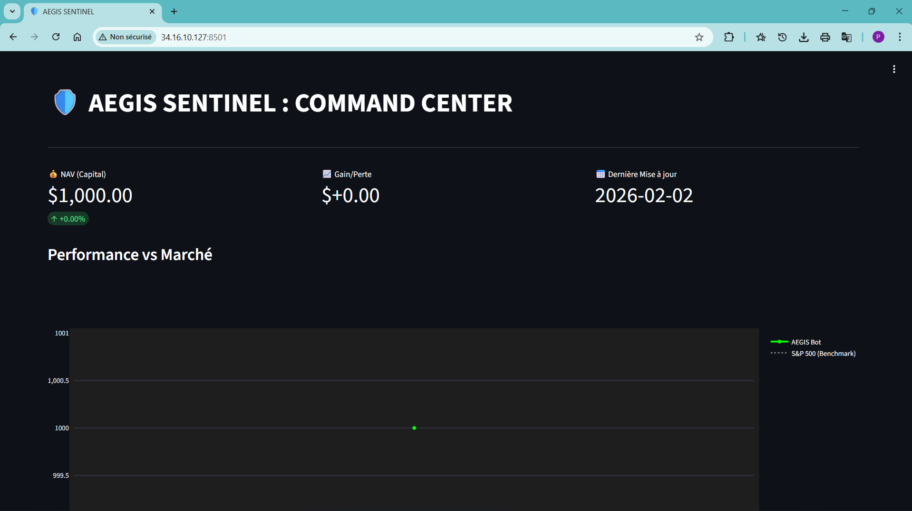
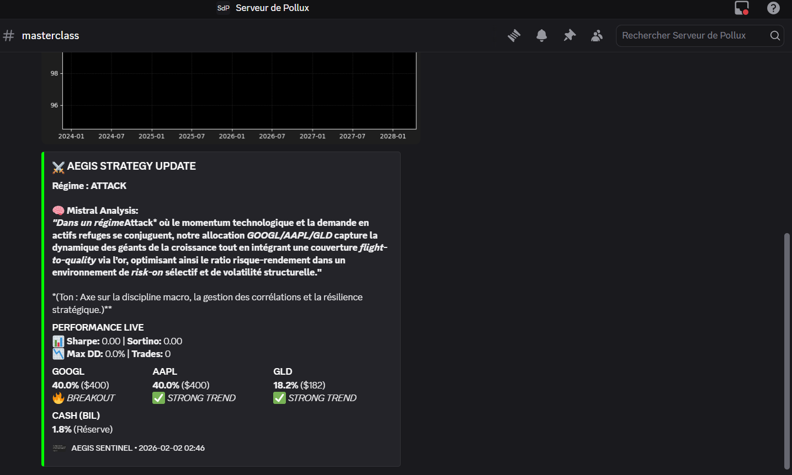
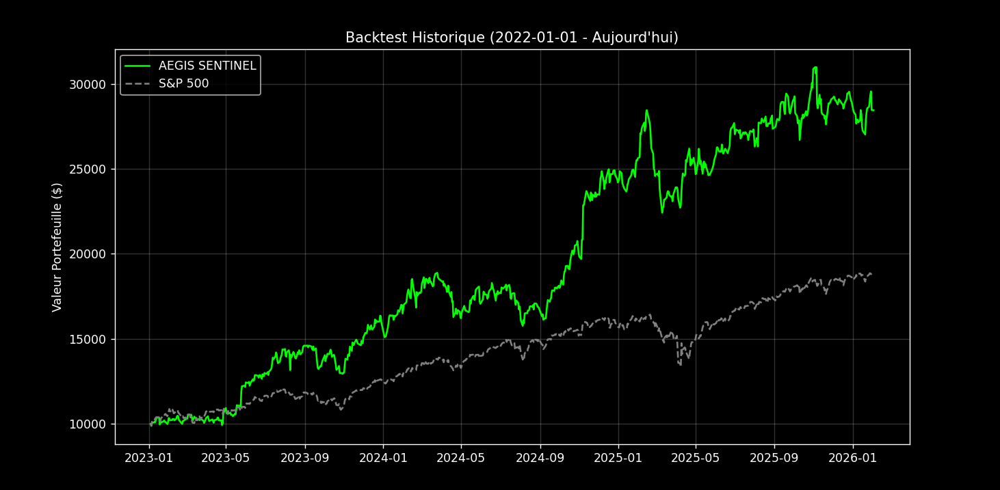

# 🛡️ Project AEGIS: Autonomous AI-Driven Portfolio Hedge Fund


**AEGIS** est un système de trading algorithmique institutionnel conçu pour la gestion autonome d’un portefeuille multi-actifs (Actions Tech, ETFs, Or). Contrairement aux bots classiques basés sur des indicateurs techniques isolés, AEGIS utilise un **« AI Logic Gate »** (Mistral Large 2) pour valider chaque signal technique via une analyse de sentiment macro-économique en temps réel.

---

## 🏗️ Architecture du Système (Sentinel Framework)

Le système opère 24/7 sur une instance Google Cloud et exécute un cycle de décision structuré en quatre couches de défense.

```mermaid
graph TD
    subgraph "1. DATA LAYER (Vision)"
        A[Yahoo Finance API] -->|Historical Data| B[curl_cffi / yfinance]
        B -->|OHLCV Data| C[Data Cleaning & Features]
    end

    subgraph "2. INTELLIGENCE LAYER (Brain)"
        C --> D{Market Regime Filter}
        D -->|Price > SMA 200| E[Mode ATTACK]
        D -->|Price < SMA 200| F[Mode DEFENSE]
        E --> G[Mistral Large 2 Oracle]
        G -->|Sentiment & News Check| H[Final Signal Validation]
    end

    subgraph "3. RISK & EXECUTION (Sentinel)"
        H --> I[Dynamic Rebalancing]
        I -->|Notional Trading| J[Alpaca Markets API]
        J -->|Order Confirmation| K[Portfolio State Management]
    end

    subgraph "4. MONITORING (Interface)"
        K --> L[Streamlit Dashboard]
        K --> M[Discord Sentinel Reports]
    end

    style G fill:#7C3AED,color:#fff
    style D fill:#f96,stroke:#333
    style J fill:#00d1b2,color:#fff
````

### Cycle de Décision AEGIS

**Ingestion & Hygiène**
Le bot collecte les données de 32 actifs via une session `curl_cffi` afin de garantir la stabilité des flux et contourner les limitations réseau sur Google Cloud.

**Filtre de Régime**
Le système analyse le SPY par rapport à sa moyenne mobile à 200 jours (SMA 200). En régime baissier, toute prise de risque est verrouillée et le portefeuille se replie en Cash ou Or.

**Validation IA**
Mistral Large 2 agit comme filtre final. Il analyse les actualités récentes associées aux actifs techniquement sélectionnés afin d’éliminer les faux signaux (bull traps).

**Exécution & Surveillance**
Les ordres sont exécutés via Alpaca en cash-only (sans levier). L’état du portefeuille est synchronisé avec le dashboard Streamlit et notifié automatiquement sur Discord.

---

## 🧠 Stratégie « Trend King » & Gestion des Risques

**Market Regime Filter**
Analyse de la tendance primaire via la SMA 200 sur le SPY.
• **Régime ATTACK** : Prix > SMA200 → déploiement du capital sur les actifs à fort momentum.
• **Régime DEFENSE** : Prix < SMA200 → liquidation des positions risquées et refuge en Cash / Or.

**Anti-Leverage Policy**
Allocation strictement basée sur le cash disponible (notional trading) afin d’éliminer tout risque de liquidation.

**Dynamic Rebalancing**
Rééquilibrage automatique du portefeuille pour maintenir une exposition optimale entre leaders de marché et actifs défensifs.

**Asset Universe**
Surveillance dynamique de 32 tickers incluant indices (`SPY`, `QQQ`), leaders Tech (`AAPL`, `NVDA`, `GOOGL`) et actifs refuges (`GLD`).

---

## 📊 Monitoring & Visual Intelligence

**Live Dashboard**
Interface Streamlit temps réel (port 8501) affichant la courbe d’équité, le régime actif et l’état du portefeuille.


**Discord Sentinel**
Reporting quotidien automatisé avec snapshots graphiques et résumé de l’analyse IA.


---

## ⚡ Backtesting & Validation Pipeline

**Vectorized Backtesting**
Simulations `pandas` sur deux ans de données historiques OHLCV pour calcul du ratio de Sharpe et du drawdown maximal.

**Out-of-Sample Testing**
Validation du modèle sur des données inédites afin d’éviter l’overfitting.

**Stress Testing**
Simulation de crashs de marché (ex. 2022) pour vérifier l’efficacité du basculement automatique en mode **DEFENSE**.

| Scénario Testé       | Comportement Observé            | Impact sur le Portefeuille             |
| -------------------- | ------------------------------- | -------------------------------------- |
| Marché Haussier      | Long-only sur leaders Tech      | Maximisation du rendement              |
| Marché Volatile      | Rotation vers Or (GLD) & Cash   | Réduction drastique du drawdown        |
| Annonces Macro (Fed) | Pause stratégique via Oracle IA | Évitement de la volatilité court terme |

---
### 📊 Aperçu des Performances du Backtest (2023 - 2026)

Le graphique ci-dessous compare la croissance d'un capital initial de **$10,000** entre la stratégie AEGIS SENTINEL et l'indice de référence S&P 500.



* **Performance AEGIS** : +184.56% ($28,456)
* **Performance S&P 500** : +87.58%
* **Surperformance (Alpha)** : +96.98%
* **Stabilité** : On observe des phases de "plateau" horizontales correspondant aux basculements automatiques en mode **DEFENSE**, préservant le capital lors des baisses du marché.
  

## 🛠️ Technology Stack

**Core** : Python 3.11 (architecture modulaire `Brain`, `Data`, `Execution`)

**Cloud** : Google Cloud Platform (Compute Engine Debian)

**IA** : Mistral Large 2 (validation décisionnelle via NLP)

**Visuals** : Plotly & Streamlit

**Automation** : Scripts Bash Sentinel pour auto-restart et persistance

**Sécurité** : Configuration VPC stricte, exposition limitée au port `tcp:8501`

---

## 🚀 Installation & Autonomous Setup

### 1. Initialisation

```bash
python3 -m venv venv
source venv/bin/activate
pip install -r requirements.txt
```

### 2. Déploiement du Trading Bot (24/7)

```bash
# Lancement en arrière-plan avec protection contre les crashs
nohup ./run_bot.sh > output.log 2>&1 &
```

### 3. Déploiement du Dashboard

```bash
# Lancement de l’interface visuelle sur le port 8501
nohup python3 -m streamlit run interfaces/dashboard.py \
  --server.port 8501 \
  --server.address 0.0.0.0 > streamlit.log 2>&1 &
```

---

## 🛡️ Disclaimer

Ce projet est une démonstration technique de finance quantitative.
Le trading comporte des risques réels. L’utilisation de ce logiciel est sous l’entière responsabilité de l’utilisateur.


# 🛡️ Project AEGIS: Autonomous AI-Driven Portfolio Hedge Fund


**AEGIS** is an institutional-grade algorithmic trading system designed for the autonomous management of a multi-asset portfolio (Tech Equities, ETFs, Gold). Unlike conventional bots based on isolated technical indicators, AEGIS relies on an **“AI Logic Gate”** (Mistral Large 2) to validate every technical signal through real-time macroeconomic sentiment analysis.

---

## 🏗️ System Architecture (Sentinel Framework)

The system runs 24/7 on a Google Cloud instance and executes a structured decision cycle across four defensive layers.

```mermaid
graph TD
    subgraph "1. DATA LAYER (Vision)"
        A[Yahoo Finance API] -->|Historical Data| B[curl_cffi / yfinance]
        B -->|OHLCV Data| C[Data Cleaning & Features]
    end

    subgraph "2. INTELLIGENCE LAYER (Brain)"
        C --> D{Market Regime Filter}
        D -->|Price > SMA 200| E[ATTACK Mode]
        D -->|Price < SMA 200| F[DEFENSE Mode]
        E --> G[Mistral Large 2 Oracle]
        G -->|Sentiment & News Check| H[Final Signal Validation]
    end

    subgraph "3. RISK & EXECUTION (Sentinel)"
        H --> I[Dynamic Rebalancing]
        I -->|Notional Trading| J[Alpaca Markets API]
        J -->|Order Confirmation| K[Portfolio State Management]
    end

    subgraph "4. MONITORING (Interface)"
        K --> L[Streamlit Dashboard]
        K --> M[Discord Sentinel Reports]
    end

    style G fill:#7C3AED,color:#fff
    style D fill:#f96,stroke:#333
    style J fill:#00d1b2,color:#fff
````

### AEGIS Decision Cycle

**Ingestion & Data Hygiene**
The bot collects data for 32 assets using a `curl_cffi` session to ensure data stability and bypass network limitations on Google Cloud.

**Market Regime Filter**
The system analyzes the SPY relative to its 200-day Simple Moving Average (SMA 200). In bearish conditions, all risk exposure is locked and capital is shifted into Cash or Gold.

**AI Validation**
Mistral Large 2 acts as a final validation layer, analyzing recent news associated with technically selected assets to eliminate false signals (bull traps).

**Execution & Monitoring**
Orders are executed via Alpaca on a cash-only basis (no leverage). System state is synchronized with the Streamlit dashboard and automatically reported on Discord.

---

## 🧠 “Trend King” Strategy & Risk Management

**Market Regime Logic**
Primary trend detection using the SMA 200 on SPY.
• **ATTACK Regime**: Price > SMA200 → capital deployment into high-momentum assets.
• **DEFENSE Regime**: Price < SMA200 → liquidation of risky positions and flight to Cash / Gold.

**Anti-Leverage Policy**
Strict allocation based exclusively on available cash (notional trading), fully eliminating liquidation risk.

**Dynamic Rebalancing**
Automatic portfolio rebalancing to maintain optimal exposure across market leaders and defensive assets.

**Asset Universe**
Dynamic monitoring of 32 tickers including indices (`SPY`, `QQQ`), tech leaders (`AAPL`, `NVDA`, `GOOGL`), and safe-haven assets (`GLD`).

---

## 📊 Monitoring & Visual Intelligence

**Live Dashboard**
Real-time Streamlit interface (port 8501) displaying equity curve, active regime, and portfolio state.


**Discord Sentinel**
Automated daily reporting with chart snapshots and AI-generated analysis summaries.


---

## ⚡ Backtesting & Validation Pipeline

**Vectorized Backtesting**
`pandas`-based simulations over two years of historical OHLCV data to compute Sharpe ratio and maximum drawdown.

**Out-of-Sample Testing**
Model validation on unseen data to prevent overfitting.

**Stress Testing**
Market crash simulations (e.g., 2022) to verify the effectiveness of automatic switching into **DEFENSE** mode.

| Tested Scenario    | Observed Behavior                  | Portfolio Impact                |
| ------------------ | ---------------------------------- | ------------------------------- |
| Bull Market        | Long-only exposure to Tech leaders | Return maximization             |
| Volatile Market    | Rotation into Gold (GLD) & Cash    | Drastic drawdown reduction      |
| Macro Events (Fed) | Strategic pause via AI Oracle      | Short-term volatility avoidance |

---

## 🛠️ Technology Stack

**Core**: Python 3.11 (modular architecture: `Brain`, `Data`, `Execution`)*

**Cloud**: Google Cloud Platform (Compute Engine, Debian)

**AI**: Mistral Large 2 (decision validation via NLP)

**Visuals**: Plotly & Streamlit

**Automation**: Bash Sentinel scripts for auto-restart and persistence

**Security**: Strict VPC configuration, limited exposure on `tcp:8501`

---

## 🚀 Installation & Autonomous Setup

### 1. Initialization

```bash
python3 -m venv venv
source venv/bin/activate
pip install -r requirements.txt
```

### 2. Trading Bot Deployment (24/7)

```bash
# Run the bot in the background with crash protection
nohup ./run_bot.sh > output.log 2>&1 &
```

### 3. Dashboard Deployment

```bash
# Launch the visual interface on port 8501
nohup python3 -m streamlit run interfaces/dashboard.py \
  --server.port 8501 \
  --server.address 0.0.0.0 > streamlit.log 2>&1 &
```

---

## 🛡️ Disclaimer

This project is a technical demonstration of quantitative finance.
Trading involves real risk. Use of this software is entirely at the user’s own responsibility.

